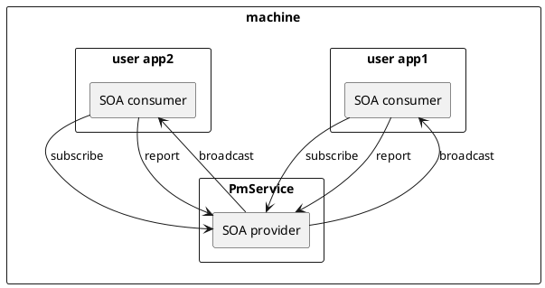

# AutoCore Power Management Service User Guide

\newpage
\large
**Revisions**

\normalsize
| Revision | Date       | Author     | Approver  | Changes                     |
|----------|------------|------------|-----------|-----------------------------|
| 0.1      | 2023/07/25 | Gu Mingjun | Hao Jin   | Initial draft               |

\newpage
## Introduction

PmService(Power Management Service), based on the SOA (Service-Oriented Architecture) framework of CM (Communication Management), provides upper-layer users with the subscription service of power off, sleep or wake up events.



\newpage
## Prerequisite

- A compatible operating system (e.g. Linux, QNX, Android).
- A compatible C++ compiler that supports at least C++14.
- CMake for building the project.
- [ACOS-SDK](http://release.autocore.ai/Projects/AutoCore.OS/Release_all) that supports at least *0.11.0*.

\newpage
## Install the SDK

First, download the latest version of ACOS-SDK:
```sh
curl -sSL $ACOS_SDK_URL -o AutoCore.OS.deb
```

Next, use the command `dpkg` to install the package:
```sh
dpkg -i AutoCore.OS.deb
```

Set up the `PATH` and `LD_LIBRARY_PATH` environment variables:
```sh
export PATH=$PATH:/opt/autocore/bin:/opt/autocore-deps/bin
export LD_LIBRARY_PATH=$LD_LIBRARY_PATH:/opt/autocore-deps/lib:/opt/autocore/lib
```

\newpage
## Create a project using PmService

### Project with Runnable

As an example, create a Runnable project, using PmService, named `pmclient` with the command `acrg` supported by ACOS-SDK:
```sh
acrg -l -n pmsclient -c import:object/pm/PowerMgmtObj@soa/pmservice.json:pms
```

The directory structure generated by the above command is as follows:
```txt
pmsclient
|-- CMakeLists.txt
|-- Loader.cc
|-- app.json
`-- pmsclient.cc
```

To subscribe or report power event, add your custom code to `pmclient.cc` file:
```cpp
class pmsclient : public EventBasedRunnable
{
    void on(const pm::PowerMgmtObjSubscribeMethodReturn& msg,
            pm::PowerMgmtObjConsumer& instance, Result result)
    {
        // TODO: Handle reply for method 'subscribe'
    }

    void on(const pm::PowerMgmtObjReportMethodReturn& msg,
            pm::PowerMgmtObjConsumer& instance, Result result)
    {
        // TODO: Handle reply for method 'report'
    }

    void on(const pm::PowerMgmtObjPowerevtField& msg,
            pm::PowerMgmtObjConsumer& instance)
    {
        // TODO: Handle field for field 'powerevt'
    }

    void on(const pm::PowerMgmtObjPowerevtFieldQueryResult& msg,
            pm::PowerMgmtObjConsumer& instance, Result result)
    {
        // TODO: Handle query result for field 'powerevt'
    }
}
```

Then you'll build the project with cmake:
```sh
cmake -B build && cmake --build build && cmake --install build
```

The above command generates an executable file `pmsclientLoader` and a library `libpmsclient.so`:
```txt
build/dist
|-- bin
|   `-- pmsclientLoader
`-- lib
    `-- libpmsclient.so
```

### Project without Runnable

To use PmService, you'll declare a dependency on ACOS-SDK. To do this, in your project directory, add the following to your `CMakeLists.txt` file:
```cmake
if(NOT DEFINED ACRT_SDK_ROOT)
    set(ACRT_SDK_ROOT "/opt/autocore")
endif()

include("cmcg/cmcg")
cmcg_generate(
    TARGET pm_cmcg
    INCLUDES ${ACRT_SDK_ROOT}/include/pm/soa
    GEN_IDL
    FILES pm/pmservices.json
)

target_link_libraries(
    PRIVATE pm_cmcg
}
```

\newpage
## Run

The `pmservice` program provides power event notification services as a SOA provider. Enter the following command as `root`:
```txt
# pmservice

================================================================================
                               PROCESS STARTED
--------------------------------------------------------------------------------
Time       : 2023-07-25 14:27:23.562
Process    : pmservice(73)
LibVerion  : 2.3.3
LibPath    : /opt/autocore/lib/libddsc.so.2
--------------------------------------------------------------------------------
```

After `pmservice` starts, run `pmsclientLoader` as a SOA consumer which subscribes to PmServices:
```txt
# ./build/dist/bin/pmsclientLoader app.json

================================================================================
                               PROCESS STARTED
--------------------------------------------------------------------------------
Time       : 2023-07-25 14:27:28.598
Process    : pmsclientLoader(109865)
LibVerion  : 2.3.3
LibPath    : /opt/autocore/lib/libddsc.so.2
--------------------------------------------------------------------------------
```

Run the DLT program to trace (run `dlt-daemon -d` first). Below is example output:
```txt
$ dlt-receive -a loacalhost

2023/07/25 14:27:23.559115   78600173 012 ECU1 DLTD INTM log info V 1 [ApplicationID 'PMS' registered for PID 109595, Description= Power Management Service]
2023/07/25 14:27:23.560956   78600191 013 ECU1 DLTD INTM log info V 1 [ApplicationID 'App' registered for PID 109595, Description=Runtime App]
2023/07/25 14:27:23.561069   78600191 000 ECU1 App- 0001 log info V 5 [109595 pmsctx.cc : 31 State changed to 1]
2023/07/25 14:27:23.568400   78600265 001 ECU1 App- 0001 log info V 5 [109595 pmsctx.cc : 31 State changed to 2]
2023/07/25 14:27:28.592822   78650510 014 ECU1 DLTD INTM log info V 1 [ApplicationID 'App' registered for PID 109865, Description=Runtime App]
2023/07/25 14:27:28.592910   78650509 000 ECU1 App- 0001 log info V 5 [109865 RuntimeManager.cc : 32 Initialize to register CM.]
2023/07/25 14:27:28.594317   78650524 002 ECU1 App- 0001 log info V 5 [109865 AppJsonConfiger.cc : 20 Begin setup the app.]
2023/07/25 14:27:28.597149   78650551 000 ECU1 App- 0002 log info V 5 [109869 pmsclient.cc : 39 pm::PowerMgmtObjConsumer state changed to 1]
2023/07/25 14:27:28.706233   78651643 000 ECU1 App- 0002 log info V 5 [109605 pmsctx.cc : 37 Client 256  online]
2023/07/25 14:27:28.807210   78652651 001 ECU1 App- 0002 log info V 5 [109869 pmsclient.cc : 39 pm::PowerMgmtObjConsumer state changed to 2]
2023/07/25 14:27:29.597885   78660557 002 ECU1 App- 0002 log info V 5 [109869 pmsclient.cc : 133 Request to subscribe to uid 404, return 0]
2023/07/25 14:27:29.598118   78660560 001 ECU1 App- 0002 log info V 5 [109605 pmsctx.cc : 101 User(404) subscribed]
2023/07/25 14:27:34.599243   78710569 003 ECU1 App- 0002 log info V 5 [109869 pmsclient.cc : 145 Request to query (before update), return 0]
2023/07/25 14:27:34.599484   78710572 004 ECU1 App- 0002 log info V 5 [109869 pmsclient.cc : 150 Update power event 1, return 0]
2023/07/25 14:27:34.599550   78710574 002 ECU1 App- 0002 log info V 5 [109605 pmsctx.cc : 54 Reply to query poewr event 0 request, return 0]
2023/07/25 14:27:34.599949   78710577 005 ECU1 App- 0002 log info V 5 [109869 pmsclient.cc : 82 Query result 0, power event 0]
2023/07/25 14:27:34.600212   78710577 003 ECU1 App- 0002 log info V 5 [109605 pmsctx.cc : 154 Broadcast power event 1, return 0]
2023/07/25 14:27:34.600335   78710578 006 ECU1 App- 0002 log info V 5 [109869 pmsclient.cc : 68 Received power event 1]
2023/07/25 14:27:34.600449   78710579 007 ECU1 App- 0002 log info V 5 [109869 pmsclient.cc : 73 Report ready, uid 404, return 0]
2023/07/25 14:27:34.601192   78710590 005 ECU1 App- 0002 log info V 5 [109605 pmsctx.cc : 115 User(404) report ready]
2023/07/25 14:27:34.601349   78710592 006 ECU1 App- 0002 log info V 5 [109605 pmsctx.cc : 125 All subscribers ready for power event]
2023/07/25 14:27:39.600045   78760578 008 ECU1 App- 0002 log info V 5 [109869 pmsclient.cc : 161 Request to query (after update), return 0]
2023/07/25 14:27:39.600268   78760582 007 ECU1 App- 0002 log info V 5 [109605 pmsctx.cc : 54 Reply to query poewr event 1 request, return 0]
2023/07/25 14:27:39.600793   78760585 009 ECU1 App- 0002 log info V 5 [109869 pmsclient.cc : 82 Query result 0, power event 1]
```

\newpage
## Reference

- [ACOS_User_Manual](http://release.autocore.ai/Projects/AutoCore.OS/Release_all/AutoCore.OS-V0.11.0/SDK/Doc/ACOS_User_Manual.pdf)
- [ACOS_Runnable_Specification](http://release.autocore.ai/Projects/AutoCore.OS/Release_all/AutoCore.OS-V0.11.0/SDK/Doc/ACOS_Runnable_Specification.pdf)
- [ACOS_Runtime_SOA_Specification](http://release.autocore.ai/Projects/AutoCore.OS/Release_all/AutoCore.OS-V0.11.0/SDK/Doc/ACOS_Runtime_SOA_Specification.pdf)

