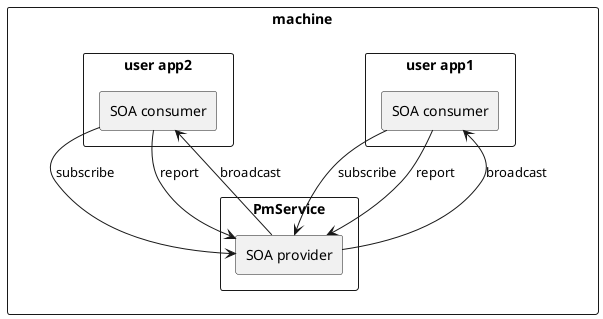

# xx User Guide

\newpage
\large
**Revisions**

\normalsize
| Revision | Date       | Author     | Approver  | Changes                     |
|----------|------------|------------|-----------|-----------------------------|
| 0.1      | 2023/07/25 |            |           | Initial draft               |

\newpage
## Introduction



\newpage
## Prerequisite

- A compatible operating system (e.g. Linux, QNX, Android).
- A compatible C++ compiler that supports at least C++14.
- CMake for building the project.

\newpage
## Install the SDK
...

Then you'll build the project with cmake:
```sh
cmake -B build && cmake --build build && cmake --install build
```

\newpage
## Run


\newpage
## Reference

